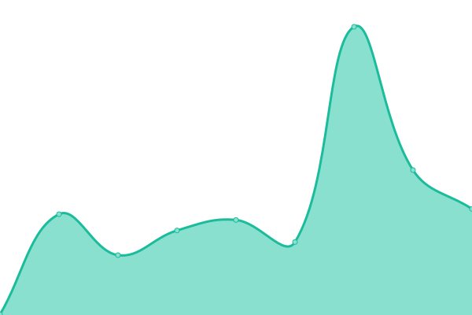

# [📈 Live Status](https://status.phixer.net): <!--live status--> **🟩 All systems operational**

This repository contains the open-source uptime monitor and status page for [Phixer](https://phixer.net), powered by [Upptime](https://github.com/upptime/upptime).

With [Upptime](https://upptime.js.org), you can get your own unlimited and free uptime monitor and status page, powered entirely by a GitHub repository. We use [Issues](https://github.com/phixer/upptime/issues) as incident reports, [Actions](https://github.com/phixer/upptime/actions) as uptime monitors, and [Pages](https://status.phixer.net) for the status page.

<!--start: status pages-->
<!-- This summary is generated by Upptime (https://github.com/upptime/upptime) -->
<!-- Do not edit this manually, your changes will be overwritten -->
<!-- prettier-ignore -->
| URL | Status | History | Response Time | Uptime |
| --- | ------ | ------- | ------------- | ------ |
|  [phixer.net](https://www.phixer.net) | 🟩 Up | [phixer-net.yml](https://github.com/phixer/upptime/commits/HEAD/history/phixer-net.yml) | 

 483ms
     
 | 

<a href="https://status.phixer.net/history/phixer-net">100.00%</a>
    

|  [ent.phixer.net](https://ent.phixer.net) | 🟩 Up | [ent-phixer-net.yml](https://github.com/phixer/upptime/commits/HEAD/history/ent-phixer-net.yml) | 

 140ms
     
 | 

<a href="https://status.phixer.net/history/ent-phixer-net">100.00%</a>
    

|  [app.phixer.net](https://app.phixer.net) | 🟩 Up | [app-phixer-net.yml](https://github.com/phixer/upptime/commits/HEAD/history/app-phixer-net.yml) | 

 215ms
     
 | 

<a href="https://status.phixer.net/history/app-phixer-net">100.00%</a>
    

|  [redfin.phixer.net](https://redfin.phixer.net) | 🟩 Up | [redfin-phixer-net.yml](https://github.com/phixer/upptime/commits/HEAD/history/redfin-phixer-net.yml) | 

 164ms
     
 | 

<a href="https://status.phixer.net/history/redfin-phixer-net">100.00%</a>
    

|  [hdestates.phixer.net](https://hdestates.phixer.net) | 🟩 Up | [hdestates-phixer-net.yml](https://github.com/phixer/upptime/commits/HEAD/history/hdestates-phixer-net.yml) | 

 121ms
     
 | 

<a href="https://status.phixer.net/history/hdestates-phixer-net">100.00%</a>
    

|  [photoport.net](https://photoport.net) | 🟩 Up | [photoport-net.yml](https://github.com/phixer/upptime/commits/HEAD/history/photoport-net.yml) | 

 234ms
     
 | 

<a href="https://status.phixer.net/history/photoport-net">100.00%</a>
    

|  S3 Zipper | 🟩 Up | [s3-zipper.yml](https://github.com/phixer/upptime/commits/HEAD/history/s3-zipper.yml) | 

 277ms
     
 | 

<a href="https://status.phixer.net/history/s3-zipper">100.00%</a>
    

<!--end: status pages-->

[**Visit our status website →**](https://status.phixer.net)

## 📄 License

- Powered by: [Upptime](https://github.com/upptime/upptime)
- Code: [MIT](./LICENSE) © [Phixer](https://phixer.net)
- Data in the `./history` directory: [Open Database License](https://opendatacommons.org/licenses/odbl/1-0/)
